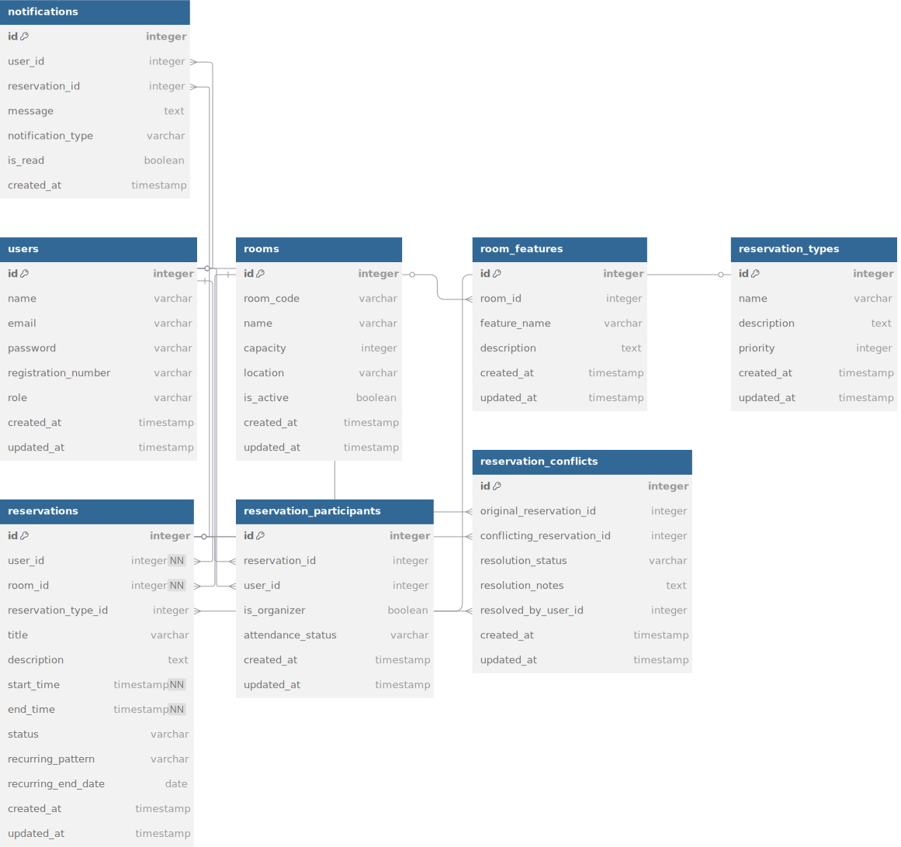

# Sistema de Reserva de Salas - Inteli

## Descrição do Sistema

O Sistema de Reserva de Salas é uma aplicação web desenvolvida para gerenciar a reserva e utilização das salas de reunião do Inteli (R01 até R10). O sistema permite que estudantes e funcionários possam agendar as salas disponíveis para reuniões, trabalhos em grupo, mentorias e outras atividades acadêmicas, garantindo organização e otimização dos espaços compartilhados.

### Características principais:

- **Reserva de Salas**: Agendamento de salas de reunião (R01 até R10) com datas e horários específicos
- **Gerenciamento de Usuários**: Cadastro e controle de estudantes, professores e administradores
- **Controle de Disponibilidade**: Visualização em tempo real das salas disponíveis
- **Agendamentos Recorrentes**: Possibilidade de agendar reservas periódicas (semanais, mensais)
- **Notificações**: Sistema de alerta para confirmação e lembretes de reservas
- **Relatórios**: Geração de relatórios de utilização por sala, usuário ou período

## Estrutura de Pastas e Arquivos

```
./
├── .env.example           # Exemplo de variáveis de ambiente
├── .gitignore             # Arquivos ignorados pelo Git
├── assets/                # Arquivos estáticos
│   └── banco-salas.pdf    # Diagrama do banco de dados
├── config/                # Arquivos de configuração
│   └── database.js        # Conexão com o banco de dados
├── controllers/           # Lógica de controle das requisições
│   └── HomeController.js  # Controlador da página inicial
├── docs/                  # Documentação do projeto
│   └── wad.md             # Web Application Document
├── jest.config.js         # Configuração de testes
├── models/                # Definição dos modelos de dados
│   └── User.js            # Modelo de usuário
├── package-lock.json      # Versões exatas das dependências
├── package.json           # Dependências do projeto
├── readme.md              # Documentação do projeto (este arquivo)
├── rest.http              # Testes de API
├── routes/                # Definição das rotas do sistema
│   └── index.js           # Rotas principais
├── scripts/               # Scripts
│   └── ini.sql            # Configuração sql
│   └── runSQLScript.sql   # Configuração sql
├── server.js              # Arquivo principal que inicializa o servidor
├── services/              # Serviços auxiliares
│   └── userService.js     # Serviço para gerenciamento de salas
```

## Modelo de Dados

O sistema utiliza um banco de dados relacional com as seguintes entidades principais:

- **Users**: Armazena informações dos usuários (estudantes, professores e administradores)
- **Rooms**: Armazena informações sobre as salas de reunião (R01 até R10)
- **Reservations**: Registra cada reserva realizada pelos usuários
- **RoomFeatures**: Características específicas de cada sala (capacidade, recursos disponíveis)
- **ReservationTypes**: Categoriza os tipos de reserva (reunião, mentoria, grupo de estudo, etc.)
- **Notifications**: Sistema de notificação para alertar usuários sobre suas reservas

O diagrama do banco de dados está disponível em <a href="./assets/banco-salas.pdf">`assets/banco-salas.pdf`</a>.<br>



## Como Executar o Projeto Localmente

### Pré-requisitos

- Node.js (v14 ou superior)
- npm ou yarn
- PostgreSQL (para o banco de dados)

### Passos para Execução

1. Clone o repositório:

```bash
git clone git@github.com:Kaian-Moura/Projectdb.git
cd inteli-assignments/Projectdb
```

2. Instale as dependências:

```bash
npm install
```

3. Configure as variáveis de ambiente: **(ainda não necessário).**

```bash
cp .env.example .env
# Edite o arquivo .env com seus dados de conexão ao banco
```

4. Crie o banco de dados: (**ainda não necessário).**

```bash
# Execute o SQL disponível na documentação para criar o schema
psql -U seu_usuario -d nome_do_banco -f schema.sql
```

5. Execute o servidor:

```bash
npm start
```

6. Acesse o sistema no navegador:

```
http://localhost:3000 ou http://127.0.0.1:3000/
```

## Funcionalidades Principais

- Visualização de disponibilidade das salas
- Reserva de salas por períodos específicos
- Cancelamento e alteração de reservas
- Visualização de histórico de reservas pessoais
- Notificações de confirmação e lembretes

## Tecnologias Utilizadas

- **Backend**: Node.js, Express
- **Banco de Dados**: PostgreSQL
- **Frontend**: HTML, CSS, JavaScript

## Testes

Para executar os testes, utilize o comando:

```bash
npm test
```

## Documentação Adicional

A documentação completa da arquitetura web está disponível em <a href="./docs/wad.md">`docs/wad.md`</a>.
